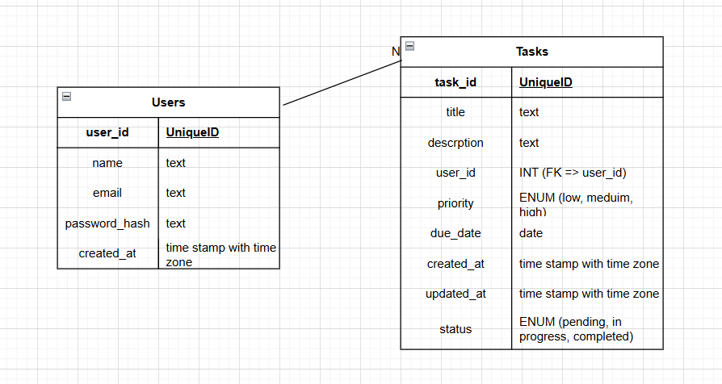

# Task Management API

A simple task management REST API built with FastAPI.

## Database Design



The system includes:

- **Users** - Manage user accounts
- **Tasks** - Create and track tasks

### Installation

1. **Clone the repository**

   ```bash
   git clone <repository-url>
   cd <project-directory>
   ```

2. **Create a virtual environment**

   On Windows:

   ```bash
   python -m venv venv
   venv\Scripts\activate
   ```

   On macOS/Linux:

   ```bash
   python3 -m venv venv
   source venv/bin/activate
   ```

3. **Install dependencies**

   ```bash
   pip install -r requirements.txt
   ```

4. **Run the application**
   ```bash
   uvicorn main:app --reload
   ```
